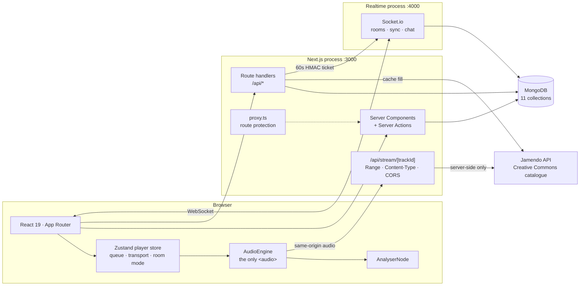
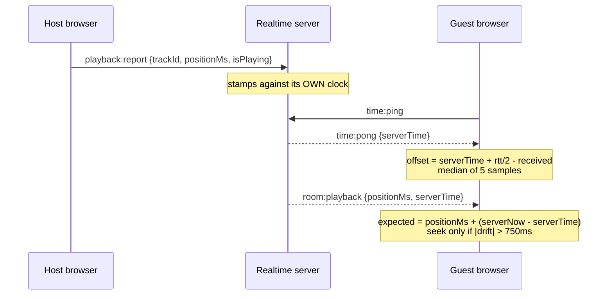
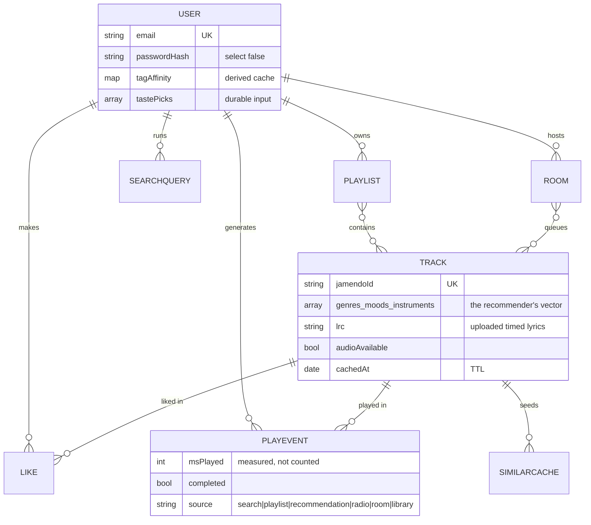

# Architecture

Two processes, one database, one external API.

## Why the audio is proxied

`app/api/stream/[trackId]` exists to do three jobs, and dropping any one of
them breaks something visible:

1. **Same-origin audio.** A cross-origin media element taints the Web Audio
   graph, and `getByteFrequencyData` then returns silence forever with no
   error. The visualizer is downstream of this decision.
2. **`Range` pass-through.** Without 206 Partial Content the scrubber cannot
   seek, only restart.
3. **Content-Type normalisation.** Jamendo's stable download URL answers
   `text/html` for an MP3, which some browsers refuse to play.

It also hides `JAMENDO_CLIENT_ID`, which never reaches the browser.

## Why the realtime server is separate

App Router route handlers are request-scoped: invoked once per request, unable
to hold a WebSocket open or keep room state between connections. A realtime
server needs a long-lived process, so it gets one — with its own
`package.json`, so it runs and deploys independently.

It authenticates with a **ticket, not a cookie**. The Auth.js session cookie is
`httpOnly`, so the browser cannot hand it to a socket, and `SameSite=Lax`, so a
cross-origin handshake would not carry it anyway. The web app mints a
60-second HMAC ticket naming one user and one room; the realtime process
verifies the signature and needs to know nothing about Auth.js.

The server is the authority and the host is only the input. Two things follow:
somebody joining halfway through a track lands in the right place without the
host doing anything, and a host on a bad connection makes itself late rather
than dragging the room.

## Data model

Three shapes are worth explaining:

- **`PlayEvent` is its own collection.** Play history is unbounded and would
  eventually breach the 16MB BSON limit as an array on the user; every play
  would rewrite the whole user document; and the statistics need their own
  indexes.
- **`tagAffinity` is a cache, `tastePicks` is input.** The profile is rebuilt
  from scratch on every recompute, so picks written straight into it would be
  erased by the listener's first play.
- **`Room` is a durable shadow.** Live room state is in the realtime process's
  memory; the document is written on a 3-second debounce and read back only
  when a room is first opened after a restart.

## The module map

| Concern | Module | Pure? |
| --- | --- | --- |
| Jamendo client | `lib/jamendo.ts` | no — network, Zod-validated |
| Cache layer | `lib/track-cache.ts` | no |
| Search + discovery | `lib/search.ts` | no |
| **Recommender scoring** | `lib/scoring.ts` | **yes** — 51 tests |
| Taste profile | `lib/affinity.ts` | no |
| Tag rarity (IDF) | `lib/tag-stats.ts` | no |
| Statistics pipelines | `lib/aggregations/*` | no — seven pipelines |
| **Room protocol + sync maths** | `lib/room-protocol.ts` | **yes** |
| **Handshake tickets** | `lib/room-ticket.ts` | **yes** — node:crypto only |
| **LRC parsing** | `lib/lrc.ts` | **yes** — 21 tests |
| **Rate limiting** | `lib/rate-limit.ts` | **yes** |

The pure modules are pure deliberately. A recommender whose scoring lives
inside an aggregation pipeline can only be evaluated by running it against real
data and squinting at the output; one that takes plain maps and returns plain
numbers can be asserted about.

`lib/room-ticket.ts`, `lib/room-protocol.ts` and `lib/track-view.ts` are
imported by **both** processes. One definition of the signature format, one of
the wire protocol, one of what a track looks like.

## Where the decisions are

Every non-obvious choice is numbered in [`SPEC.md`](../SPEC.md) §8, from D1 to
D49. The ones worth reading first:

| | |
| --- | --- |
| **D4** | MongoDB publishes on 27018 — a local `mongod` silently shadows a container on 27017 |
| **D23** | Jamendo's `/tracks/similar` returns nothing, so the documented fallback is the live mechanism |
| **D26** | The recommender has exactly one output surface, and that is the whole product |
| **D33** | Streaks computed in the pipeline with `$documentNumber` + `$dateSubtract` |
| **D34** | Seven pipelines rather than one `$facet`, because a `$facet` sub-pipeline cannot use an index |
| **D38** | Rooms authenticate with a ticket because the session cookie is `httpOnly` *and* `SameSite=Lax` |
| **D40** | A follower's transport is locked, not corrected after the fact |
| **D43** | A seek issued before the media has metadata is silently dropped |
| **D50** | A `loading.tsx` turns `notFound()` into an HTTP 200 |
